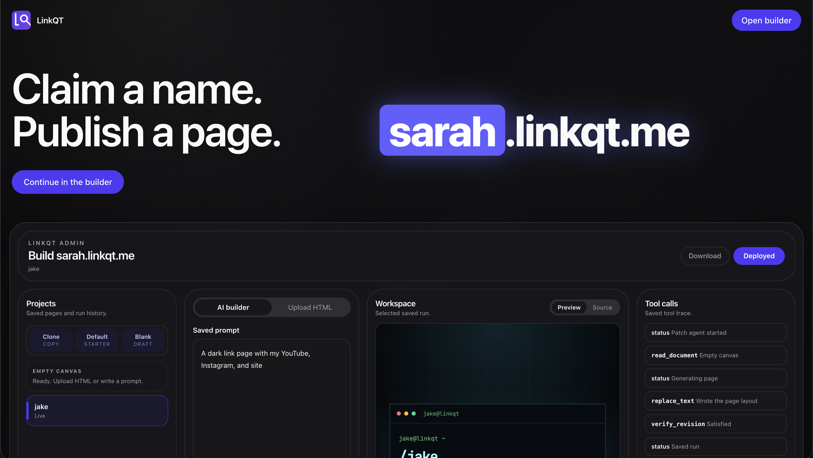

# LinkQT

LinkQT is a place to claim one name and publish one page.

You sign in, pick a permanent namespace, then build or upload a self-contained HTML page. That page is yours at:

```txt
you.linkqt.me
linkqt.me/you
```

The builder can write the page from a prompt, or you can paste your own HTML. Projects keep a history of saved runs. Deploying a completed run publishes it to your namespace. One account gets one name. Reserved platform names (`admin`, `www`, `auth`, and the rest) stay off limits.



## How it works

- Sign in, then claim a namespace before you can publish.
- Start from a blank canvas, a default starter page, or your own HTML.
- Ask the builder to generate or revise the page. It edits the document in place and keeps a tool trace for each AI run.
- Save new versions without overwriting old ones. A parent run with children cannot be deleted.
- Deploy a completed run to your namespace. The live page is that run’s HTML.

The admin UI lives at `/admin`. Published pages are the only thing served on a claimed name.

## Local development

```bash
bun install
bun run dev
```

The app listens on `http://localhost:3000`. Browser calls go to same-origin `/api` with a session bearer token. Do not set `NEXT_PUBLIC_LINKQT_API_URL` unless the browser should talk to a different API origin.

Create a `.env.local` with:

```txt
NEXT_PUBLIC_CLERK_PUBLISHABLE_KEY=
CLERK_SECRET_KEY=
CLERK_JWT_KEY=
CLERK_AUTHORIZED_PARTIES=
DATABASE_URL=
MODEL_API_KEY=
LINKQT_AI_DAILY_LIMIT=25
LINKQT_AI_TIMEOUT_MS=120000
LINKQT_AI_RETRY_COUNT=1
LINKQT_ENABLE_AI_PROXY=false
LINKQT_TEST_AUTH=false
CRON_SECRET=
```

`DATABASE_URL` is a Postgres connection string. `MODEL_API_KEY` is the server-side key for the OpenAI-compatible chat API. The browser never talks to the model host.

## Namespace routing

Shared reserved-name rules live in `lib/linkqt-namespaces.ts`.

```txt
admin.linkqt.me        -> 302 to https://www.linkqt.me/admin
linkqt.me/admin        -> signed-in builder
www.linkqt.me/admin    -> same
foo.linkqt.me/         -> published page for foo
linkqt.me/foo          -> published page for foo
linkqt.me/foo/anything -> 404 for now
```

Public pages are read in `app/site/[subdomain]/route.ts`.

## API

Authenticated browser requests send:

```txt
Authorization: Bearer <session token>
```

Local scripts can enable a test bearer with `LINKQT_TEST_AUTH=true`. That path is disabled when `VERCEL_ENV=production`. Requests without an `Authorization` header are rejected.

```txt
GET  /api/health
GET  /api/me/profile
GET  /api/me/stats
POST /api/me/subdomain
GET  /api/builder/projects
POST /api/builder/manual-project
POST /api/builder/blank-project
POST /api/builder/blank-run
POST /api/builder/rename-project
POST /api/builder/revise
POST /api/builder/revise/stream
POST /api/builder/version
POST /api/builder/clone-project
POST /api/builder/delete-project
POST /api/builder/delete-run
POST /api/builder/deploy
GET  /api/builder/runs/:runId/tool-events
GET  /api/cron/fail-stale-runs
```

## Testing

```bash
bun run typecheck       # TypeScript / API / client / scripts
bun run frontend:build  # UI, Next routes, or client
bun run linkqt:test     # smoke test against a running app
bun run test:api-ai     # fake-upstream AI and API coverage
bun run ai:e2e          # real-upstream patch-agent check
```

## Layout

```txt
app/api/[[...path]]/route.ts     HTTP API
lib/server/linkqt-api.ts         builder, auth, and AI loop
lib/server/db.ts                 Postgres pool
app/admin/page.tsx               builder UI
app/site/[subdomain]/route.ts    published page
proxy.ts                         auth gate and namespace routing
lib/builder-client.ts            browser client for /api
```
